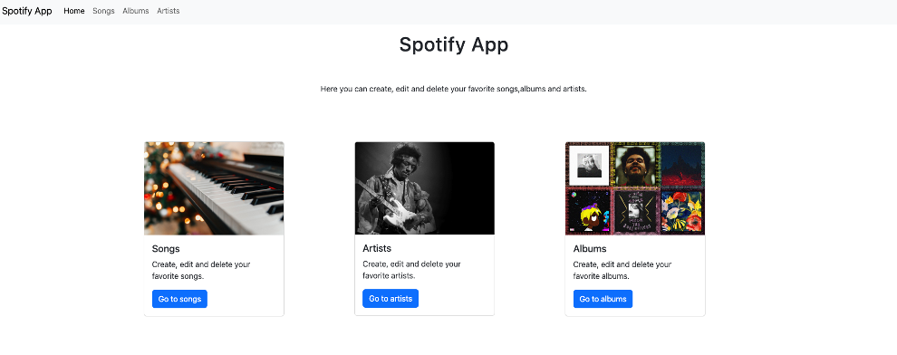
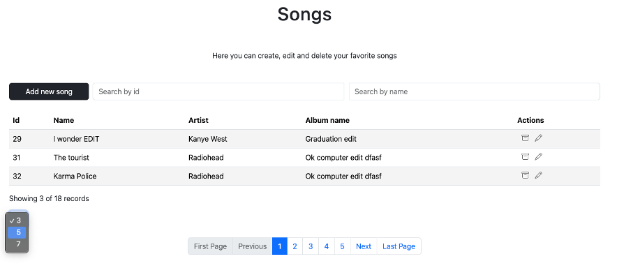
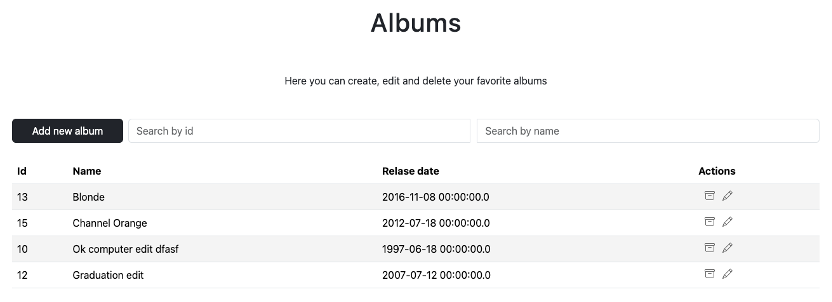
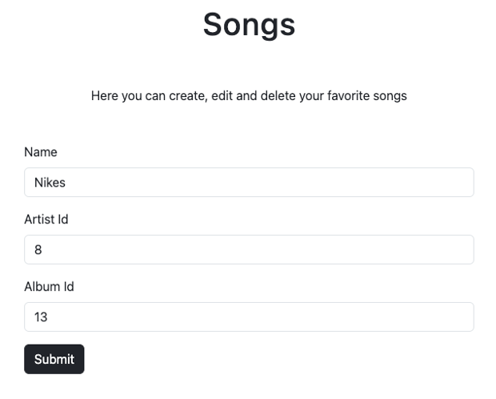

## Spotify App

### Technologies
- Java
- Spring Boot
- Hibernate, Spring JPA
- PostgreSQL
- Thymeleaf

### Description
Basic project with three interrelated entities: Song, Album, Artist. CRUD operations are performed through a web interface using Thymeleaf, following best practices in the backend.
- Use of controller, service, and repository layers
- Queries using the Hibernate ORM and Spring JPA
- Pagination
- Error handling
- Use of DTOs and mappers

### Images

  

  

  

  

